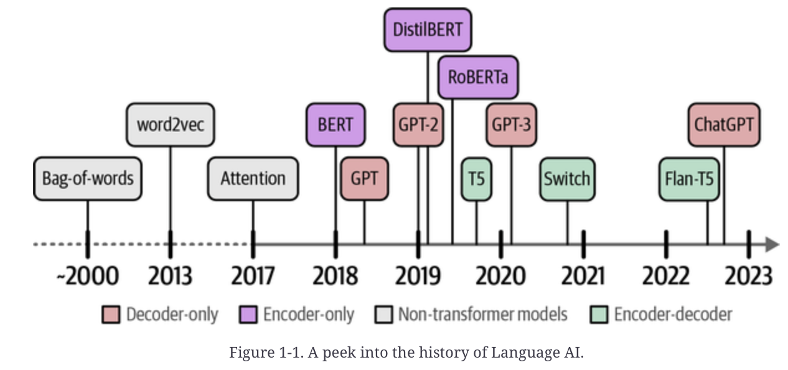

# Hands-On-LLMs
## A Recent History of Language AI
- A peek into the history of Language AI. 
- ![[Pasted image 20250227174648.png]]
- Language AI is capable of many tasks by processing textual input. ![[Pasted image 20250228155103.png]]
- A vocabulary is created by retaining all unique words across both sentences. ![[Pasted image 20250228155659.png]]
- A bag-of-words is created by counting individual words. These values are referred to as vector representations. ![[Pasted image 20250228160147.png]]
- A neural network is trained to predict if two words are neighbours. During this process, the embeddings are updated to be in line with the ground truth. ![[Pasted image 20250228163425.png]]
- The values of embeddings represent properties that are used to represent words. We may oversimplify by imagining that dimensions represent concepts (which they don't), but it helps express the idea. ![[Pasted image 20250228164114.png]]
- Embeddings of words that are similar will be close to each other in dimensional space. ![[Pasted image 20250228164712.png]]
- Embeddings can be created for different types of input. ![[Pasted image 20250308225251.png]]
- Two recurrent neural networks (decoder and encoder) translating an input sequence from English to Dutch. ![[Pasted image 20250309140722.png]]
- 